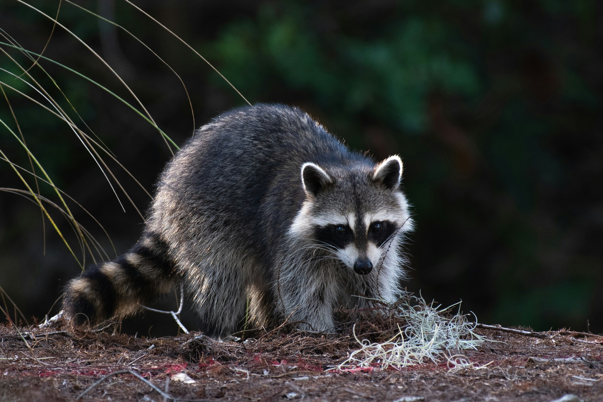

# Case Study

#### Case Study: Revolutionizing Animal Trapping with OcuTrap Technology

**Introduction**

**Background**: OcuTrap combines sensor technology with remote monitoring for domestic and wild animal control. This can reduce manual trap inspections.

<figure><figcaption></figcaption></figure>

**Objective**: This case study looks at OcuTrap's effectiveness in a real-world animal-control deployment, including efficiency, humane use, and safety for animals and operators.

**Case Study Overview**

**Location**: Springfield, a suburban area where a growing raccoon population caused urban challenges.

**Client**: The Springfield Municipal Council, seeking an effective and humane solution for wildlife control.

**Challenges**

1. **High Raccoon Population**: Causing public health concerns and property damage.
2. **Resource Constraints**: Limited staff and resources to monitor and manage traditional traps.
3. **Humanitarian Concerns**: Ensuring humane treatment of the captured animals.

**Solution**

The Council deployed 50 OcuTrap devices at key locations in Springfield. It used:

* **Remote Monitoring**: Sending instant notifications upon the trapping of an animal.
* **Smart Controls**: Enabling remote opening and closing of the trap door.
* **Selective Targeting**: Sensors that ensure only the target species (raccoons in this case) are captured.

**Implementation**

* **Setup**: Staff placed traps in high-visibility areas with frequent raccoon activity.
* **Training**: Local animal control staff were trained on using the OcuTrap app for monitoring and managing the traps.
* **Monitoring Period**: The traps were monitored over a 3-month period.

**Results**

* **Efficiency**: 90% reduction in manual trap checks.
* **Effectiveness**: 75% increase in raccoon captures compared to traditional methods.
* **Humane Treatment**: Zero incidents of harm to non-target animals or the captured raccoons.
* **Public Approval**: Positive feedback from the community for using a humane and tech-forward approach.

**Conclusion**

OcuTrap demonstrated its ability to manage urban wildlife while addressing humane-treatment and resource concerns. The deployment benefited the community and wildlife.

**Future Recommendations**

* **Expansion**: Implementing OcuTrap in other urban areas with similar challenges.
* **Technology Upgrades**: Continuing to enhance sensor accuracy and remote capabilities.
* **Community Engagement**: Educating the public on humane and effective wildlife management practices.

This case study shows how OcuTrap can support humane, efficient wildlife management and control.
