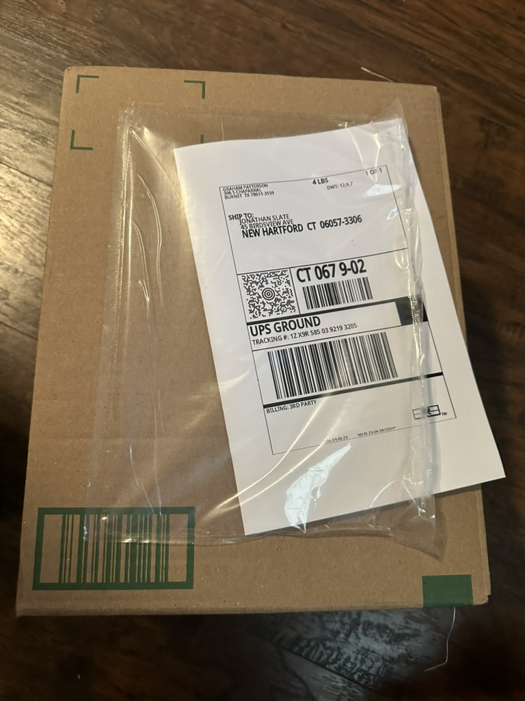

# Jun 1 Installation

You can remove the old clips because they might get in the way of the updated clips.

<figure><figcaption>
Top clips
</figcaption></figure>

<figure><figcaption>
Bottom clips
</figcaption></figure>

<figure><figcaption>
The camera and sensor will be centered
</figcaption></figure>

<figure><figcaption>
The return label for old POD can be placed in the same pouch.
</figcaption></figure>
