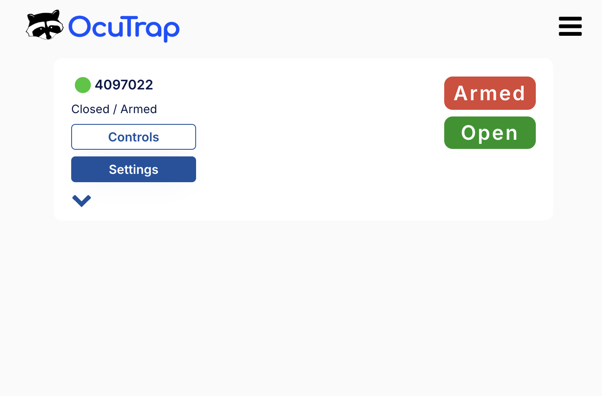
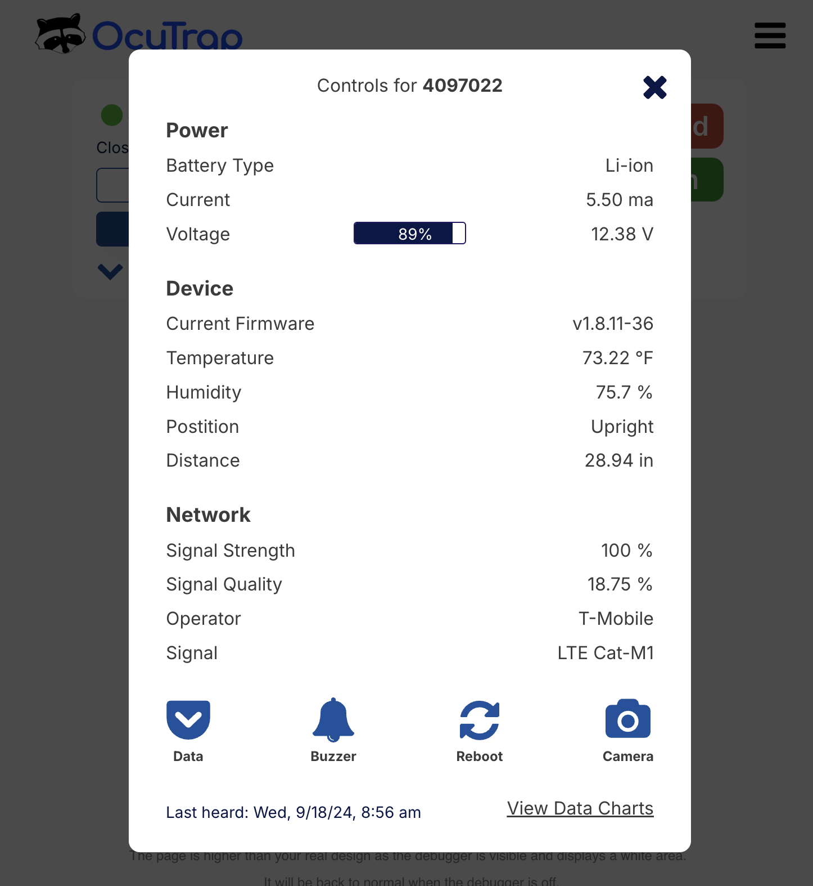

# Manually taking an image

Go to your console page. Click on the controls icon

<figure><figcaption></figcaption></figure>

Click on the camera icon on the bottom right

<figure><figcaption></figcaption></figure>

### Fast image request

Tap the lightning bolt icon to request an image faster. The trap returns a lower-quality image in exchange for the speed boost — useful when you need to check on something right now.


Available on firmware **v550 and newer**. Older traps will not show the lightning bolt option — update firmware to enable it.

