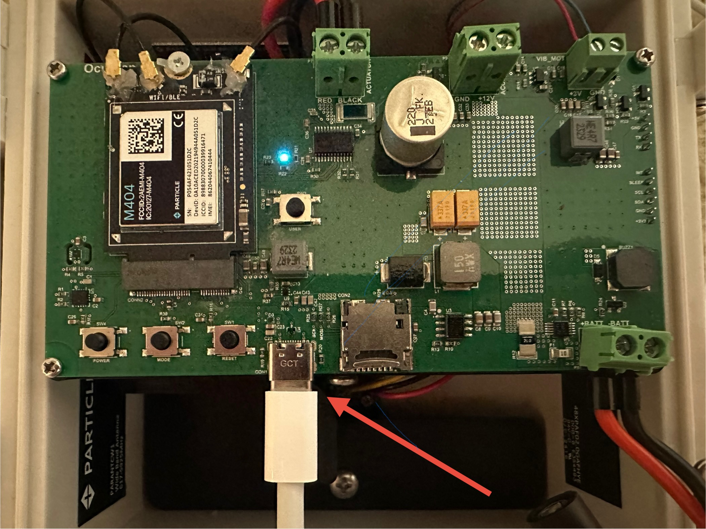

# Cloud Debug Guide for OcuTrap

This guide provides instructions on using the Particle Web Device Doctor and cloud debug firmware for troubleshooting OcuTrap. Cloud debug allows you to check account status, SIM status, and perform other checks on your device.

***

### Requirements

1. **Device and Cable**: OcuTrap device and USB-C cable (connect to the USB-C port on the OcuTrap circuit board).
2.  **Browser**: Use a supported browser for cloud debug:

    * **Chrome** (version 61+ on Windows, Mac, Linux, Chromebook, or Android)

    **Note**: For unsupported browsers (e.g., Safari, Firefox, or iOS devices)

***

### Step-by-Step Guide

1. **Power off OcuTrap:** Unplug the battery
2. **Connect your OcuTrap**: Plug the USB-C cable into the designated port on the OcuTrap circuit board, and the other side into your computer
   * _Refer to the diagram below to locate the USB-C port on your OcuTrap device_
   * USB-C on bottom edge of the circuit board
3. **Power on OcuTrap:** Plug the battery back in
4. **Open the Cloud Debug Page**: Using a supported browser, navigate to the Particle Cloud Debug page. [https://docs.particle.io/troubleshooting/connectivity/cloud-debug/](https://docs.particle.io/troubleshooting/connectivity/cloud-debug/)
5. **Select Device**:
   * Click **Select Device**.
   * Choose your device from the list.
   * Click **Connect**.
6. Wait for up to 30s for the device to connect.
7. Update to requested firmware if requested. This will take about 5 min.

**Under Viewing the Results:**

* **Web Serial Monitor (Chrome only)**: If using Chrome (version 89+), you can view the debug output directly in the web serial console.

You can monitor the output in the USB serial debug console:\
Click "Connect"

**Click the Reset Button on the OcuTrap Circuit Board**

<figure><figcaption></figcaption></figure>

The debug log is complete when the device is pulsing blue.&#x20;

Here is an example of how the code will look

<figure><figcaption>
Here is an example of how the code will look
</figcaption></figure>

Once the debug log output has been captured, please copy the results and send them to OcuTrap support at **support@ocutrap.com** for further analysis.\
